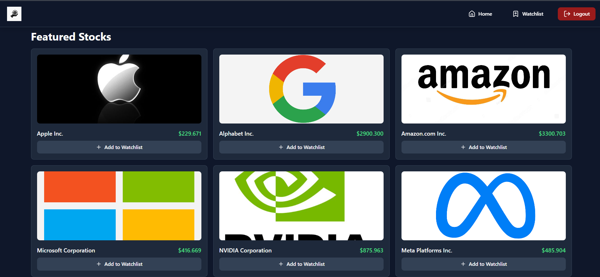
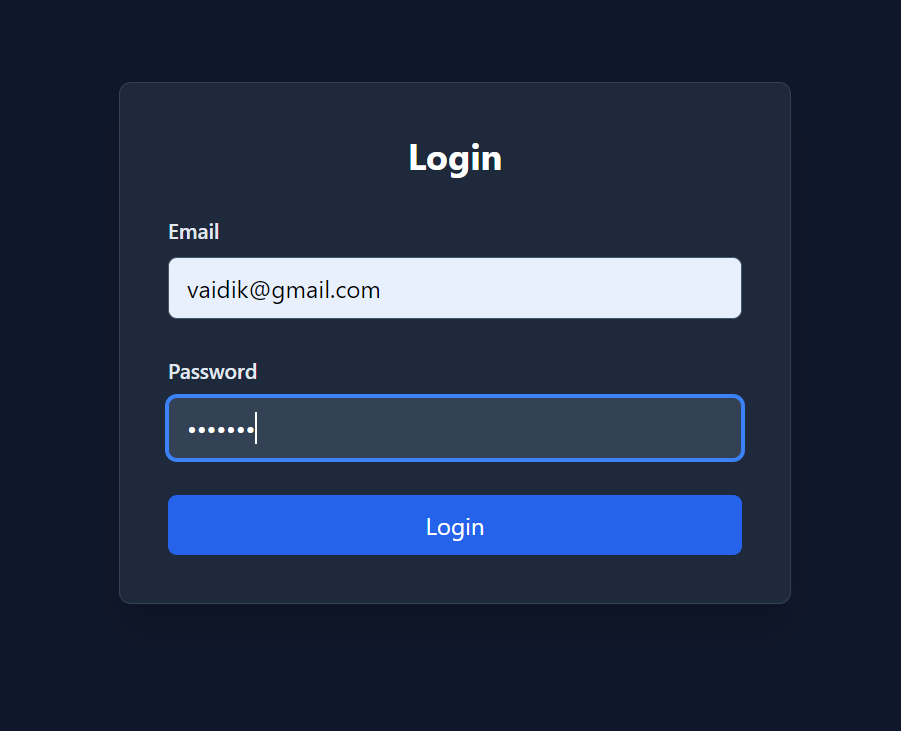
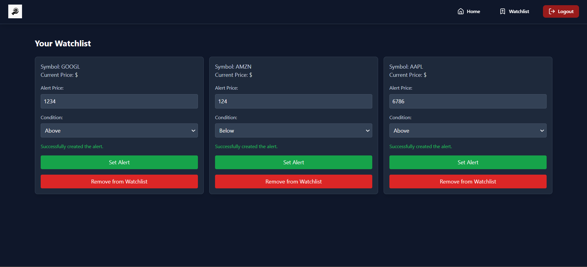

# Real-Time Stock Price Tracker 📈

A dynamic and intuitive stock price tracker application that provides real-time updates, allows users to manage a personalized watchlist, and receive notifications for stock alerts. This project is built with React and Tailwind for the frontend and Node.js/Express for the backend, featuring WebSocket integration for live data streaming.

## Table of Contents 📚

- [Video Demonstration](#video-demonstration)
- [Features](#features)
- [Technologies Used](#technologies-used)
- [Installation](#installation)
- [Usage](#usage)

## Video Demonstration 🎥

[Watch the demonstration on Loom 📽️](https://www.loom.com/share/46536ab1b59b4ee1981c2d30d3a5bf2e?sid=54bbeedf-50d3-408a-8f80-045d913f9343)

## Features 🌟

- **Real-time stock price updates** using Finnhub API  
  

- **User authentication** (Login/Signup)  
  

- **Watchlist management** (Add, view, and remove stocks)  
  

- **Stock price alert notifications** via email (Nodemailer) and SMS (Twilio)  
  

- **WebSocket integration** for live updates 🔄
- **Responsive design** for mobile and desktop 📱💻

## Technologies Used ⚙️

- **Frontend**:

  - React
  - React Router
  - Tailwind CSS

- **Backend**:

  - Node.js
  - Express
  - MongoDB (or any other database you use)
  - JWT (for authentication)
  - WebSockets (for real-time data)
  - Nodemailer (for email notifications)
  - Twilio (for SMS notifications)

- **API**:
  - Finnhub API (for stock data)

## Installation ⚡

1. Clone the repository:

   ```bash
   git clone https://github.com/vaidik24/Real-Time-Stock-Price-Tracker.git
   ```

2. Navigate to the project directory:

   ```bash
   cd Real-Time-Stock-Price-Tracker
   ```

3. Install the frontend dependencies:

   ```bash
   cd Frontend
   npm install
   ```

4. Install the backend dependencies:

   ```bash
   cd ./Backend
   npm install
   ```

5. Set up environment variables:  
   Create a `.env` file in the backend directory and add the required environment variables (such as MongoDB URI, JWT secret, Finnhub API key, Twilio credentials, and email SMTP settings). Refer to the `.envsample` file for guidance.

6. Start the backend server:

   ```bash
   npm run dev
   ```

7. Start the frontend:

   ```bash
   cd ./Frontend
   npm run dev
   ```

## Usage 🚀

1. Sign up or log in to create a personalized watchlist.
2. Add stocks to your watchlist and receive live updates.
3. Set price alerts for stocks in your watchlist to get notifications via email and SMS.
4. View live stock data and updates directly on the dashboard.

---

Feel free to modify or let me know if you need any further adjustments!
